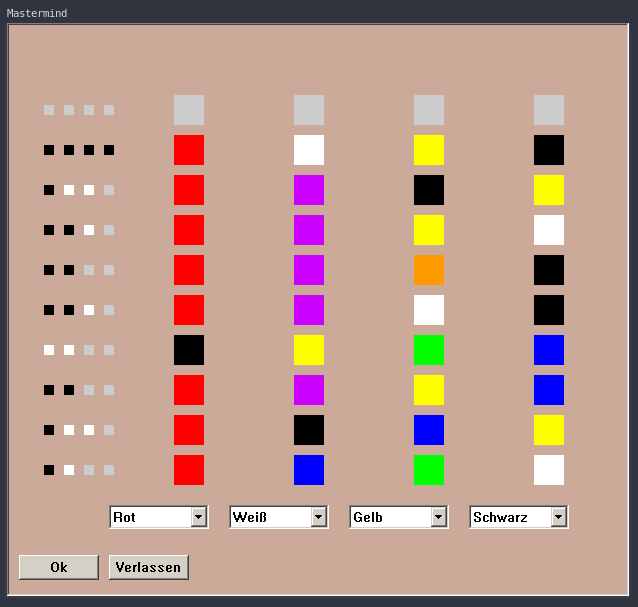

# Mastermind

Some of my early steps in programming GUI applications with C++.
Seems like the last time I compiled it was the 23rd of October 2009, but I think it is quite a bit older.

## The Game

This is a digital version of the (at least in my childhood) popular board game "Mastermind".
Your opponent (in this case the computer) thinks of a code of four colors in a particular order.
You can guess by presenting a color code to your opponent.

You will then receive an answer with white or black dots (in no particular order).
Black dots mean you guessed a color correctly and it is at the correct position.
White dots mean you guessed a correct color but it is at the wrong position.

This way, you can figure out the correct code or lose trying.

## The Technical Stuff

This game was written in C++ using the Dev-C++ IDE.
It has some Windows dependecies (might have been on Vista back then) so I can't port it to real operating systems without significantly modifying the code.
However, it runs without problems with Wine.

## The Legal Stuff

For sure I stole all kinds of code snippets from tutorials around the world wide web.
But also, I can't remember which parts or which tutorials as it's been over twelve years.
